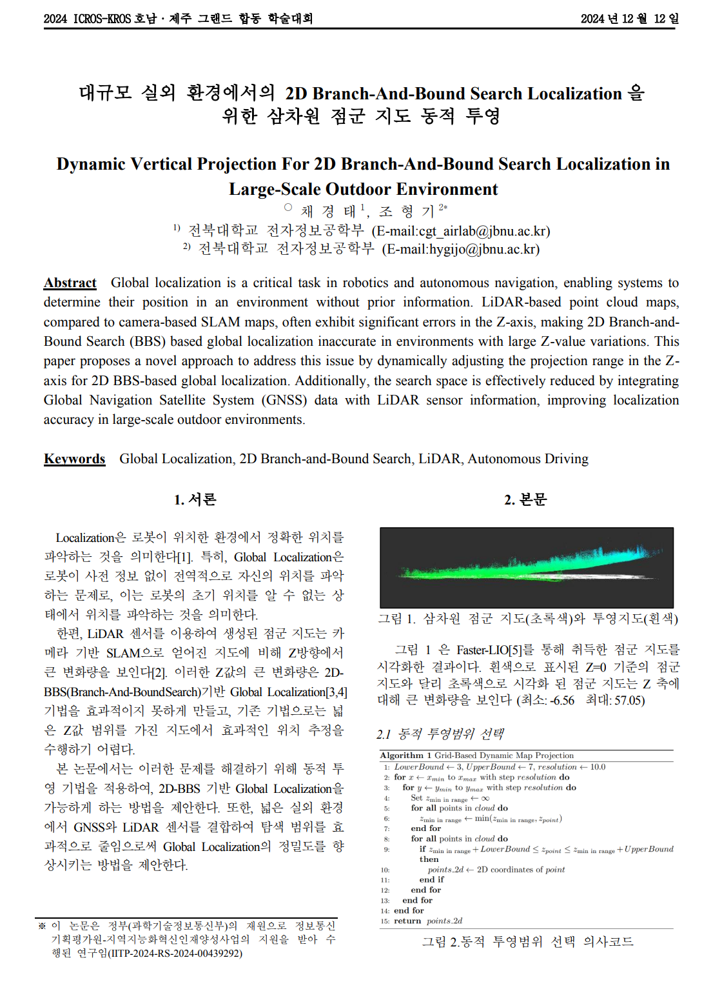

# hdl_global_localization

## 1. Dynamic Projection
- Modified the slice function in `GlobalLocalizationBBS::slice` in `src/engines/global_localization_bbs`.
- When there is a significant variance in the z-values of the map point cloud data (pcd), performing `bbs_localization` becomes challenging.
- This feature aims to dynamically project the map, taking into account the distribution of surrounding z-values.

## 2. Reduced Search Region Using GNSS 
- `BBS localization` struggles in large target areas (as do other algorithms).
- We aim to reduce the search area using GPS sensor data.
- The search is confined to the vicinity of the GNSS receiving point.
